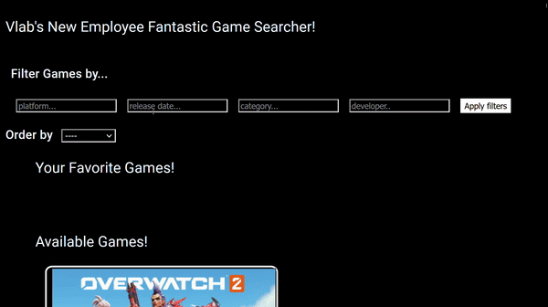
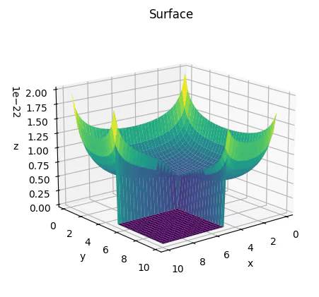

# Gabriel Ferreira da Silva

hi 👋,

I'm a computer engineering student. Currently looking forward to study and work on software engineering, fullstack web applications, machine learning and numerical computation.

### programing languages

these are some of my favorite programing languages, the ones i use regularly

    
    
    
    
    
        

### frameworks stack 

These are the frameworks i like to work with

    
    
    
    
    
        
        
        
        
     

### some projects...

    <a href="https://github.com/gabriel-ferreira-da-silva/Nilo" style="text-decoration: none; color: inherit; display: flex; flex-direction:row; align-items: center;">
            
        

            <h2>FreeGame Searcher</h2>
            

                Angular Frontend interface for the freegame API, built with search, filter, and responsive actions.
            

        

    </a>

       	
        
        

            <h2>FreeGame Searcher</h2>
            

                Angular Frontend interface for the freegame API, built with search, filter, and responsive actions.
            

        

    <a href="https://github.com/gabriel-ferreira-da-silva/metodo-dos-momentos" style="text-decoration: none; color: inherit; display: flex; align-items: center;">
        

            
        

        

            <h2>Metodos Numericos</h2>
            

                python notebook implementation of numerical methods for electromagnetic problems.
            

        

    </a>

​	

