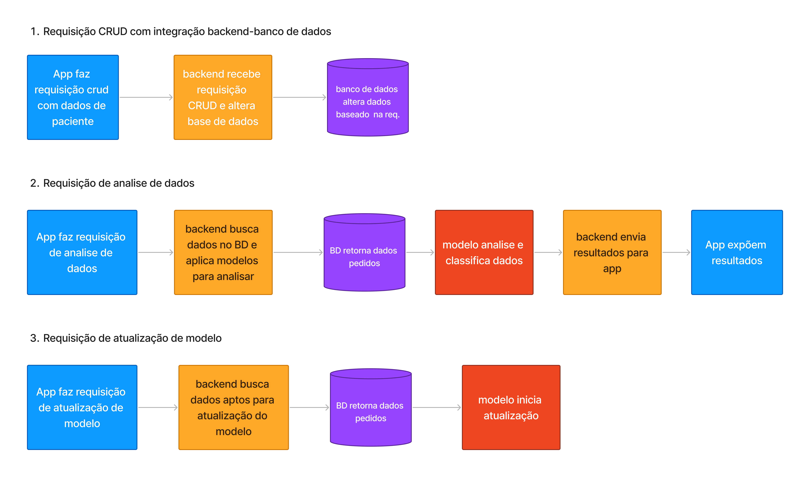

# Gabriel Ferreira da Silva

hi 👋,

I'm a computer engineering student. Currently looking forward to study and work on software engineering, fullstack web applications, machine learning and numerical computation.

### programing languages

    
    
    
    
    
        

### frameworks stack 

    
    
    
    
    
        
        
        
        
     

### some projects...

Nilo

Freegame Searcher

 

GalenoAPI

MetNum

